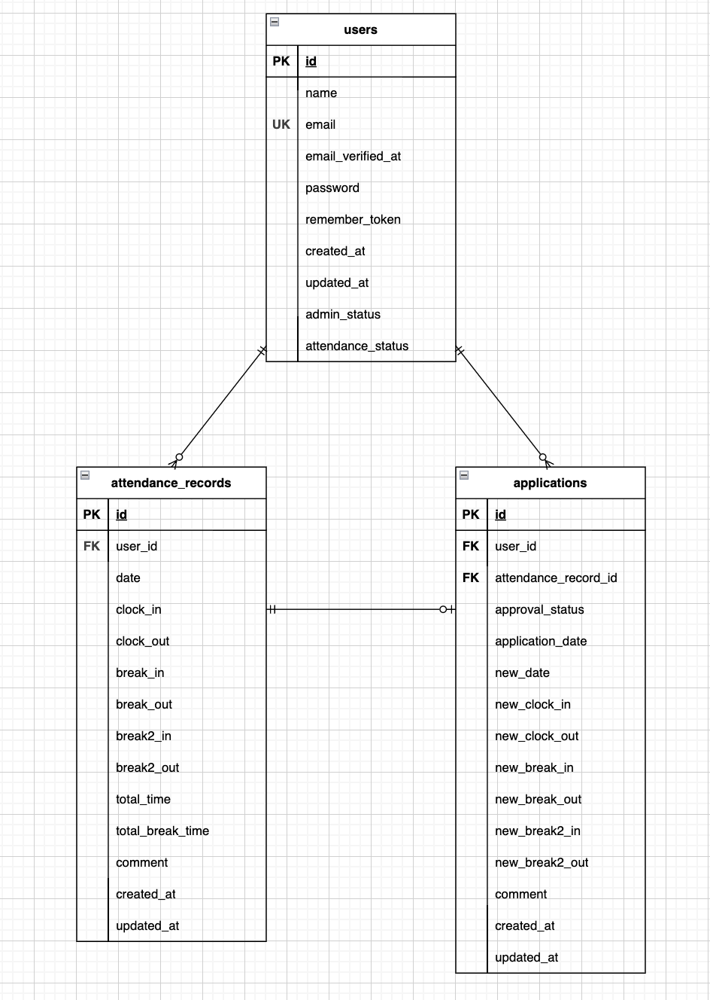

# coachtech-mockcase-2
## 環境構築
Dockerビルド  
1.git clone git@github.com:coachtech-material/laravel-docker-template.git  
2.docker-compose up -d --build  

Lavaral環境構築  
1.docker-compose exec php bash  
2.composer install  
3.cp .env.example .env  
4..envファイルの変更  
```
　DB_HOSTをmysqlに変更  
　DB_DATABASEをlaravel_dbに変更  
　DB_USERNAMEをlaravel_userに変更  
　DB_PASSをlaravel_passに変更  
　MAIL_FROM_ADDRESSに送信元アドレスを設定  
```
5.php artisan key:generate  
6.php artisan migrate  
7.php artisan db:seed  
8.php artisan test  

## テーブル仕様
### usersテーブル
| カラム名 | 型 | primary key | unique key | not null | foreign key |
| --- | --- | --- | --- | --- | --- |
| id | bigint | ◯ |  | ◯ |  |
| name | varchar(255) |  |  | ◯ |  |
| email | varchar(255) |  | ◯ | ◯ |  |
| email_verified_at | timestamp |  |  |  |  |
| password | varchar(255) |  |  | ◯ |  |
| remember_token | varchar(100) |  |  |  |  |
| created_at | timestamp |  |  |  |  |
| updated_at | timestamp |  |  |  |  |
| admin_status | tinyint |  |  | ◯ |  |
| attendance_status | varchar(255) |  |  | ◯ |  |

### attendance_recordsテーブル
| カラム名 | 型 | primary key | unique key | not null | foreign key |
| --- | --- | --- | --- | --- | --- |
| id | bigint | ◯ |  | ◯ |  |
| user_id | bigint |  |  | ◯ | users(id) |
| date | date |  |  | ◯ |  |
| clock_in | time |  |  | ◯ |  |
| clock_out | time |  |  |  |  |
| break_in | time |  |  |  |  |
| break_out | time |  |  |  |  |
| break2_in | time |  |  |  |  |
| break2_out | time |  |  |  |  |
| total_time | varchar(255) |  |  |  |  |
| total_break_time | varchar(255) |  |  |  |  |
| comment | varchar(255) |  |  |  |  |
| created_at | timestamp |  |  |  |  |
| updated_at | timestamp |  |  |  |  |

### applicationsテーブル
| カラム名 | 型 | primary key | unique key | not null | foreign key |
| --- | --- | --- | --- | --- | --- |
| id | bigint | ◯ |  | ◯ |  |
| user_id | bigint |  |  | ◯ | users(id) |
| attendance_record_id | bigint |  |  | ◯ | attendance_records(id) |
| approval_status | varchar(255) |  |  | ◯ |  |
| application_date | date |  |  | ◯ |  |
| new_date | date |  |  | ◯ |  |
| new_clock_in | time |  |  | ◯ |  |
| new_clock_out | time |  |  | ◯ |  |
| new_break_in | time |  |  |  |  |
| new_break_out | time |  |  |  |  |
| new_break2_in | time |  |  |  |  |
| new_break2_out | time |  |  |  |  |
| comment | varchar(255) |  |  | ◯ |  |
| created_at | timestamp |  |  |  |  |
| updated_at | timestamp |  |  |  |  |

## ER図


## ログイン情報  
一般ユーザー  
　id：user1@example.com／user2@example.com  
　pass：password  
管理者  
　id：user3@example.com  
　pass：password  

## 使用技術
・PHP 7.4.9  
・Laravel 8.83.8  
・MySQL 8.0.26  
・nginx 1.21.1  
・MailHog latest  

## URL
・開発環境：http://localhost/  
・phpMyAdmin：http://localhost:8080/  
・MailHog：http://localhost:8025/
